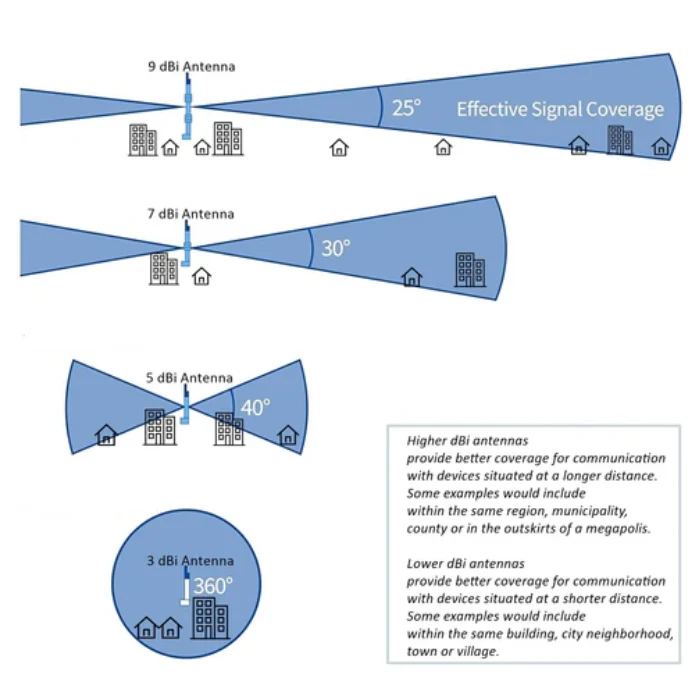

# Frequently Asked Questions
This page aims to collect frequent or common questions people may have.

## Mesh Questions

### What networks are currently active in KC? 
Currently, the KC area is primarily an unorganized meshtastic group.
Select areas may also have Meshcore nodes and repeaters as well. 

## Hardware Questions

### What antenna should I get?
If you are starting out, ^^**stick to known good brands stay around 3-5 dBi**^^ for antennas. 

[Rokland](https://store.rokland.com/collections/all-helium-antennnas) is one such decent supplier of LoRa antennas. 

ALFA 5dBi antennas are popular and can be had for [reasonable prices from rokland](https://store.rokland.com/products/alfa-aoa-915-5acm-5-dbi-omni-outdoor-915mhz-802-11ah-mini-antenna-for-lora-halow-application). 

If you are new to radio, you may initially think that you need the biggest antennna possible to be able to talk as far as possible. 
With LoRa radio, this could not be father from the truth. Unlike lower frequency AM/FM radio, LoRa emits a very short specialized "chirp" in order to send data.

Antenna design quality, tuning to the proper frequency, proper dBi and positioning of the antenna all matter much more than size. 

The second item to note is antenna dBi. With Antennas, **higher dBi values are not "stronger" in the way you think**. 

The higher the dBi for the antenna, the more the 'beam' becomes focused, to the point that a very high dBi antenna could nearly behave like a laser pointer. anyone above or below the very narrow 'beam' will not be able to hear it. 

Rokland provides a nice visual to understand how dBi influences how an antenna behaves. Note that houses underneath the zone cannot hear anything.

3-5 dBi is generally always what you will want starting out. 

The **biggest** thing you can do to help your range is get your antenna up high above physical obstacles along the ground. 
